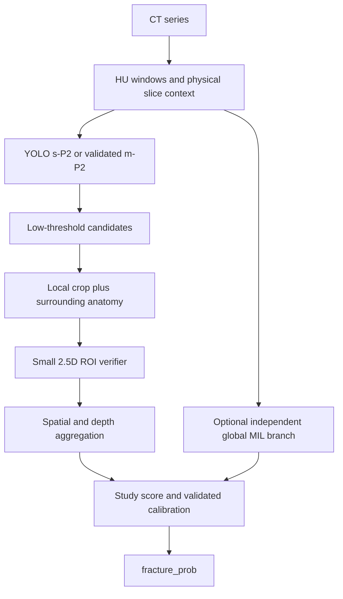

# گزارش بررسی پایپ‌لاین شکستگی جمجمه و برنامه رسیدن به QWK بالاتر از ۰٫۹۹

> **به‌روزرسانی 2026-09-09:** وضعیت اجرای rotation/Large، اصلاحات پیاده‌سازی و OOF بازتولیدشده در [IMPLEMENTATION_AUDIT_FA.md](IMPLEMENTATION_AUDIT_FA.md) آمده است. برای تصمیم‌های اجرایی، گزارش جدیدتر مبناست.

> **به‌روزرسانی 2026-09-09:** وضعیت اجرای rotation/Large، اصلاحات پیاده‌سازی و OOF بازتولیدشده در [IMPLEMENTATION_AUDIT_FA.md](IMPLEMENTATION_AUDIT_FA.md) آمده است. برای تصمیم‌های اجرایی، گزارش جدیدتر مبناست.

تاریخ بررسی: ۲۰۲۶/۰۹/۰۸ — دامنه: فقط `fracture detection` و سهم آن در امتیاز تریاژ تیم.

**پاسخ اصلی:** مدل ارسالی شما **YOLO11s با معماری سفارشی P2، ورودی 2.5D و حدود ۹٫۵۷ میلیون پارامتر** است. مدل Large می‌تواند مفید باشد، اما شواهد فعلی نشان نمی‌دهد که کمبود ظرفیت، گلوگاه اصلی باشد. اولویت پیشنهادی من عبارت است از: **یکسان‌سازی ارزیابی با مسابقه → اصلاح نمونه‌گیری منفی و بررسی خطاها → تشخیص دقیق‌تر کاندیداهای شکستگی و تجمیع مکانی → آزمایش کنترل‌شده `m-P2` و سپس `l-P2` → ارزیابی مشترک با خروجی هم‌تیمی‌ها.**

دو نتیجه عددی مهم این بررسی:

- با تابع رسمی مسابقه، خروجی‌های ذخیره‌شده پنج fold و **خونریزی/MLS واقعی**، روش فعلی `top3_mean` در آستانه ۰٫۵ به **QWK=0.969723** می‌رسد. این عدد، دقت ۹۷درصدی تشخیص شکستگی نیست.
- جست‌وجوی تمام تصمیم‌های ممکنِ یک آستانه سراسری روی همین امتیازهای موجود، بهترین QWK را **0.988725** می‌دهد. بنابراین **تنظیم آستانه به‌تنهایی، برای همین خروجی‌ها و همین پروتکل، از ۰٫۹۹ عبور نمی‌کند**. برای عبور واقعی باید ترتیب امتیازها/کیفیت تشخیص یا تجمیع بهتر شود.

هیچ معماری یا تنظیمی را نمی‌توان پیشاپیش ضامن QWK بالای ۰٫۹۹ روی آزمون پنهان دانست. در این گزارش، عددهای اندازه‌گیری‌شده از پیشنهادهایی که هنوز نیاز به آزمایش دارند جدا شده‌اند.

## ۱. چه چیزهایی بررسی شد و اعتبار نتیجه‌ها چقدر است؟

فایل `submit/model.py`، مشخصات checkpoint و تطبیق هش `submit/best.pt`، تنظیمات آموزش، مسیرهای آماده‌سازی داده، تجمیع و calibration، کد ارزیابی، splitها، گزارش‌ها و خروجی‌های هر پنج fold بررسی شدند. آمار metadata و annotationهای دیتاست با artifacts موجود تطبیق داده شد. همچنین تابع رسمی تریاژ از HTML ارائه‌شده استخراج و برای بازحساب امتیاز استفاده شد.

برای ایده‌های معماری، مستندات رسمی Ultralytics و پژوهش‌های اصلی مرتبط نیز بررسی شدند. فایل speaker identification مربوط به مسئله صوتی دیگری است و مبنای انتخاب مدل شکستگی قرار نگرفت.

در این نوبت **هیچ آموزش، تغییر کد مدل، اصلاح annotation یا inference جدید با GPU انجام نشد**. اندازه‌گیری عملکرد بر پیش‌بینی‌های از قبل ذخیره‌شده متکی است؛ بازبینی پزشکی همه تصاویر نیز انجام نشده است. گزارش، نام یک ساختار طبیعی را به‌عنوان علت قطعی هر FP اعلام نمی‌کند؛ تشخیص علت هر خطا به بازبینی تصویر نیاز دارد.

شما توضیح دادید که ۰٫۹۷ را در ارزیابی محلیِ fracture یا با سایر خروجی‌ها برابر صفر گرفته‌اید. اسکریپت/لیست نمونه‌های همان اجرای خاص مشخص نشده است؛ بنابراین تطابق عدد ۰٫۹۷ با یکی از محاسبات زیر، اثبات نمی‌کند که منشأ امتیاز شما همان بوده است.

## ۲. مدل واقعی شما چیست؟

| مؤلفه | وضعیت تأییدشده |
|---|---|
| خانواده | Ultralytics YOLO11، وظیفه object detection |
| اندازه | `s`، یعنی Small |
| معماری | `configs/yolo11s_p2.yaml` با P2/P3/P4/P5 |
| stride هدها | ۴، ۸، ۱۶، ۳۲ |
| تعداد کلاس | یک کلاس: `skull_fracture` |
| پارامترها | ۹٬۵۷۴٬۷۷۲ طبق audit معماری و انتقال وزن پروژه |
| ورودی | سه کانال از برش‌های نزدیک به `z−5mm, z, z+5mm` |
| window | WL=800، WW=1600؛ محدوده HU از ۰ تا ۱۶۰۰ |
| اندازه inference | ۷۶۸×۷۶۸؛ تصاویر اصلی ۵۱۲×۵۱۲ هستند |
| وزن اولیه | `yolo11s.pt` آموزش‌دیده روی COCO |
| انتقال وزن | حدود ۶٫۰۱ میلیون پارامتر، معادل ۶۲٫۸٪؛ حدود ۳٫۵۶ میلیون مقداردهی اولیه جدید |
| وزن ارسالی | دقیقاً `outputs/fold_1/v5_hu800_ww1600_original/weights/best.pt` |
| ensemble | وجود ندارد؛ یک detector از fold 1 |
| MIL / verifier | در submission فعال نیست |
| calibration | در submission وجود ندارد |

هش SHA256 وزن ارسالی و وزن fold 1 یکسان است:

```text
17759933df8b783c6994baaddbb9758b848a2273e0280fc7c0adf0753922b0a8
```

P2 به مدل امکان استفاده از feature map با وضوح مکانی بیشتر را می‌دهد. اما این مدل، شبکه حجمی 3D نیست: سه برش به‌صورت کانال به یک detector دوبعدی داده می‌شوند و boxها متعلق به برش مرکزی‌اند.

مسیر واقعی submission:

```text
DICOM یک سری
  → تبدیل pixel به HU و مرتب‌سازی فیزیکی برش‌ها
  → ساخت سه کانال با فاصله هدف ±5mm و window ثابت
  → YOLO11s-P2 روی تمام برش‌ها، conf=0.01 و NMS IoU=0.5
  → بیشترین confidence هر برش
  → میانگین سه confidence بزرگ‌تر در کل سری
  → fracture_prob
```

عدد `conf=0.01` آستانه نگه‌داشتن box است؛ با آستانه رسمی تصمیم مطالعه، یعنی `fracture_prob>=0.5`، تفاوت دارد.

منابع داخلی: [معماری](configs/yolo11s_p2.yaml)، [تنظیمات v5](configs/fracture_25d_p2_hu800_original.yaml)، [audit انتقال وزن](reports/pretrained_initialization_audit.json)، [submission](submit/model.py). تعریف ثابت‌ها در ابتدای submission، تجمیع در خط ۳۸۹ و خروجی‌های نهایی در `Model.predict` قرار دارند.

## ۳. مشکل اصلی قبل از مدل: کدام QWK را اندازه می‌گیریم؟

QWK، ضریب توافق وزن‌دار است و با accuracy معمولی تفاوت دارد. مسابقه از هفت مقدار میانی، کلاس تریاژ ۰/۱/۲ می‌سازد و توافق کلاس پیش‌بینی‌شده با کلاس واقعی را می‌سنجد. برای دو برچسب fracture مثبت/منفی، QWK با کاپای معمولی معادل می‌شود و معنای متفاوتی دارد.

سه ارزیابی را جدا نگه دارید:

| ارزیابی | ورودی‌های غیر fracture | کاربرد |
|---|---|---|
| تشخیص شکستگی | استفاده نمی‌شوند؛ مقایسه مستقیم با `SkullFracture` | sensitivity، specificity، PR-AUC و در صورت نیاز binary kappa |
| QWK ایزوله fracture | حجم‌های واقعی و MLS واقعی | اندازه‌گیری سهم fracture در تریاژ با فرض درست بودن دیگر اجزا |
| QWK نهایی تیم | خروجی پیش‌بینی‌شده هم‌تیمی‌ها | نزدیک‌ترین ارزیابی محلی به امتیاز مسابقه |

**صفر کردن خونریزی و MLS جایگزین ارزیابی ایزوله نیست.** در `submit/model.py` فعلی، پنج حجم و MLS صفر بازگردانده می‌شوند. با این ورودی‌ها تابع رسمی فقط کلاس ۰ یا ۱ تولید می‌کند و کلاس Critical=2 ممکن نیست.

برای تمام ۳۳۸ مطالعه همین دیتاست:

- خروجی OOF فعلی با سایر مقادیر صفر، در مقایسه با کلاس رسمی تریاژ: **QWK≈0.040515**.
- حتی fracture کاملاً واقعی با سایر مقادیر صفر: **QWK≈0.114928**.
- اگر یک پیش‌بینی‌کننده فرضی به همه برچسب‌ها دسترسی داشت، ولی فقط مجاز به خروجی تریاژ ۰/۱ بود، سقف آن برای توزیع کلاس فعلی حدود **0.711904** می‌شد.

این محاسبات نشان می‌دهند ۰٫۹۷ با «ارزیابی کامل رسمی روی تمام این داده و صفر بودن سایر سرها» سازگار نیست. باید نام معیار، زیرمجموعه ارزیابی و شیوه ساخت ground truth اجرای شما ثبت شود؛ از این اختلاف نمی‌توان درباره کیفیت یک اجرای متفاوت نتیجه گرفت.

## ۴. یک خطای واقعی در تابع ارزیابی محلی پیدا شد

در [تابع محلی](src/fracture/evaluation/triage.py)، خط ۱۶، شرط `MLS>=5` به‌تنهایی Critical برمی‌گرداند. در کد رسمی داخل [HTML مسابقه](iaaa-competition-2026-brain-ct-triage-challenge.html)، حوالی خط ۵۲۱، این وضعیت فقط وقتی Critical است که خونریزی یا شکستگی هم وجود داشته باشد. بدون هر دو، حوالی خط ۵۴۶، خروجی Urgent است.

اثر روی داده واقعی: **۹ مطالعه منفی fracture با خونریزی کمتر از ۰٫۱mL و MLS حداقل ۵mm** به اشتباه Critical می‌شوند. این اختلاف با بزرگ‌تر کردن YOLO برطرف نمی‌شود.

شناسه‌های داخلی برای بازتولید audit: `271016, 271656, 272468, 2732, 4167, 4445, 674, 880, 9248`.

| وضعیت پیش‌بینی fracture؛ سایر مقادیر واقعی | QWK با تابع محلی فعلی | QWK با تابع رسمی |
|---|---:|---:|
| برچسب واقعی fracture | 0.983689 | 1.000000 |
| همیشه منفی | 0.972423 | 0.988725 |
| `top3_mean` موجود، آستانه ۰٫۵ | 0.953723 | 0.969723 |

حجم‌ها با `area_px × PixelSpacing0 × PixelSpacing1 × SliceThickness / 1000` و جمع در سری ساخته شدند؛ MLS از بیشینه برش‌های هر سری گرفته شد. با تابع رسمی و همه مقادیر واقعی، **کلاس metadata در هر ۳۳۸ مطالعه بدون هیچ اختلافی بازتولید شد**. توزیع کلاس واقعی: ۱۶۵ routine، ۶۰ urgent، ۱۱۳ critical.

بنابراین عدد ۰٫۹۷۲۴ موجود در [گزارش calibrated](reports/oof_original/final_metrics.json) حاصل عملکرد قوی fracture نیست: همان گزارش `TP=0, FN=28, FP=0, TN=310` دارد. خروجی cross-fitted calibration بین حدود ۰٫۰۴۳ و ۰٫۳۹۰ است و هیچ مطالعه‌ای از آستانه ۰٫۵ عبور نمی‌کند. عدد ۰٫۹۷۲۴ همچنین شامل خطای تابع محلی است.

این مشکل در گزارش‌گیری محلی است؛ خود `submit/model.py` تابع تریاژ محلی را فراخوانی نمی‌کند. اگر سامانه مسابقه تابع صحیح را اجرا کند، آن خطا مستقیماً به evaluator سامانه منتقل نمی‌شود.

## ۵. عملکرد تأییدشده فعلی و تفاوت آن با «دقت ۹۷٪ fracture»

از [OOF بدون calibration](reports/oof_original_no_calibration/oof_fracture_predictions.csv)، با `top3_mean>=0.5`:

| معیار | مقدار |
|---|---:|
| مطالعات | ۳۳۸، شامل ۲۸ مثبت و ۳۱۰ منفی |
| TP / FN | ۱۲ / ۱۶ |
| FP / TN | ۲۰ / ۲۹۰ |
| حساسیت | ۴۲٫۸۶٪ |
| ویژگی | ۹۳٫۵۵٪ |
| precision | ۳۷٫۵٪ |
| PR-AUC ثبت‌شده | ۰٫۴۱۷۱ |
| AUROC ثبت‌شده | ۰٫۸۰۳۰ |
| accuracy دودویی | ۸۹٫۳۵٪ |
| binary fracture QWK | ۰٫۳۴۱۸ |
| QWK ایزوله با تابع رسمی | ۰٫۹۶۹۷ |

این جدول عملکرد پروتکل پنج‌fold ذخیره‌شده را نشان می‌دهد؛ عملکرد مستقل `best.pt` روی همه ۳۳۸ مطالعه نیست. وزن fold 1 بخشی از این مطالعات را در آموزش دیده است و inference آن روی همه داده، آزمون مستقل محسوب نمی‌شود.

در این دیتاست، اگر هدف شما واقعاً **binary fracture QWK>0.99** باشد، حتی فقط یک FN کاپا را به حدود ۰٫۹۸۰۲ و یک FP آن را به حدود ۰٫۹۸۰۸ می‌رساند. بنابراین آن هدف روی این ۳۳۸ مطالعه عملاً به صفر خطای دودویی نیاز دارد؛ بسیار سخت‌تر از QWK تریاژ بالای ۰٫۹۹ است.

## ۶. داده و آموزش: چرا Large اولین انتخاب من نیست؟

آمار تأییدشده: **۳۲۰ بیمار، ۳۳۸ سری، ۲۸ سری مثبت متعلق به فقط ۲۷ بیمار مثبت، ۷٬۶۸۳ DICOM، ۲۶۰ برش مثبت و ۳۵۶ box**. تعداد زیادی برش، معادل تعداد زیادی بیمار مستقل نیست.

در پنج fold، هم‌پوشانی بیمار بین train و validation مشاهده نشد. تعداد مثبت‌های validation برابر ۶/۶/۶/۵/۵ است. این تقسیم درست است، اما با ۵–۶ مطالعه مثبت، معیار هر fold نوسان زیادی دارد.

| fold | epochهای اجراشده | بهترین epoch بر اساس mAP50–95 | mAP50–95 | PR-AUC مطالعه با max |
|---|---:|---:|---:|---:|
| ۰ | ۴۰ | ۵ | ۰٫۰۴۷۰ | ۰٫۴۷۸۹ |
| ۱ | ۱۲۰ | ۹۲ | ۰٫۱۲۴۲ | ۰٫۵۶۷۶ |
| ۲ | ۵۵ | ۲۰ | ۰٫۰۳۴۸ | ۰٫۴۵۸۶ |
| ۳ | ۵۵ | ۲۰ | ۰٫۰۱۷۶ | ۰٫۲۳۱۳ |
| ۴ | ۵۴ | ۱۹ | ۰٫۰۸۷۰ | ۰٫۲۹۷۳ |

این نوسان و بهترین epochهای بسیار زودرس در چند fold، شاهد کافی برای underfitting ناشی از مدل کوچک نیست. همچنین `best.pt` بر اساس معیار detector انتخاب شده است؛ بهترین box localization لزوماً بهترین تصمیم مطالعه در ویژگی بالا نیست.

**نمونه‌گیری منفی ثابت، یک فرصت مهم و قابل‌آزمایش است.** در [آماده‌سازی داده](src/fracture/data/prepare_yolo.py)، خطوط ۹۱ تا ۱۴۳، منفی‌ها یک بار هنگام ساخت دیتاست انتخاب می‌شوند. در fold 1:

- ۶٬۰۴۴ برش اصلیِ واجد شرایط آموزش وجود دارد: ۲۰۶ مثبت و ۵٬۸۳۸ منفی.
- فقط ۶۱۸ منفی یکتا انتخاب شده‌اند؛ حدود **۸۹٫۴٪ منفی‌های واجد شرایط در طول این run اصلاً استفاده نشده‌اند**.
- oversampling، فهرست را به ۱٬۰۷۳ ورودی شامل ۴۱۲ مثبت و ۶۶۱ منفی می‌رساند. زیاد شدن تکرار، تنوع بیمار یا منفی تازه ایجاد نمی‌کند.

این روش ممکن است برای مقابله با عدم توازن مفید باشد، ولی مدل فرصت کمی برای دیدن تنوع ساختارهای شبیه شکستگی دارد. پیشنهاد: نسبت متوازن batchها حفظ شود، اما pool منفی به‌صورت چرخشی در epochها یا چرخه‌های آموزشی عوض شود؛ سهم هر بیمار محدود و منفی‌های دشوارِ بازبینی‌شده به آن اضافه شوند. تغییر نسبت به‌تنهایی و وارد کردن یک‌باره همه منفی‌ها هم ممکن است recall را کاهش دهد، پس باید کنترل‌شده مقایسه شود.

در v5 موجود، hard-negative mining در آموزش استفاده نشده، annotation اصلاح‌شده فعال نیست و وزن آموزش‌دیده MIL یافت نشد. وجود کد این اجزا به معنی اجرای آزمایش یا حضورشان در submission نیست.

**انتخاب fold 1 نیز محدودیت دارد:** [کد انتخاب fold](src/fracture/inference/select_best_fold.py) نتایج foldهای متفاوت روی بیماران متفاوت را مقایسه می‌کند. PR-AUC آن گزارش‌ها با `max_confidence` محاسبه شده است، طبق [predict_fold](src/fracture/evaluation/predict_fold.py)، خط ۱۹۵؛ سپس submission از `top3_mean` استفاده می‌کند. پس «بهترین fold» اثبات نمی‌کند این وزن برای بیماران جدید یا برای تجمیع نهایی بهترین است.

## ۷. دقیقاً چه چیزی برای عبور از ۰٫۹۹ باید بهتر شود؟

با سایر مقادیر واقعی، از ۲۸ مطالعه مثبت فقط **۶ مورد** به تصمیم fracture برای تعیین کلاس تریاژ وابسته‌اند. در این شش مورد، fracture موجب تغییر Urgent→Critical می‌شود. ۲۲ مثبت دیگر همچنان برای یادگیری و تشخیص fracture مهم‌اند، اما در این counterfactual خاص، کلاسشان بدون fracture هم همان است.

| سری | fold | `top3_mean` موجود | برش مثبت / کل | یافته تشخیصی از پیش‌بینی‌های ذخیره‌شده |
|---|---:|---:|---:|---|
| 1196 | ۲ | ۰٫۸۹۹۴ | ۱۸ / ۳۹ | پیشنهادهای منطبق و امتیاز بالا وجود دارد |
| 271912 | ۰ | ۰٫۵۷۷۵ | ۵ / ۳۰ | در آستانه فعلی مثبت است |
| 271623 | ۰ | ۰٫۲۶۷۱ | ۱۶ / ۳۵ | هیچ پیشنهاد با IoU≥0.1 با GT ندارد؛ امتیاز کل لزوماً روی شکستگی نیست |
| 3796 | ۰ | ۰٫۲۵۵۰ | ۶ / ۱۶ | پیشنهاد منطبق وجود دارد، اما امتیاز آن پایین است |
| 4240 | ۲ | ۰٫۲۱۷۸ | ۱۲ / ۱۶ | پیشنهاد منطبق وجود دارد، اما امتیاز پایین است |
| 272626 | ۱ | ۰ | ۱ / ۳۶ | هیچ box بالاتر از کف ذخیره‌سازی ۰٫۰۱ در کل سری وجود ندارد |

این شناسه‌ها فقط برای بازبینی خطا هستند؛ نباید به‌صورت استثنا یا قانون مبتنی بر ID وارد inference شوند. مثبت تک‌برشی `272626` نشان می‌دهد الزام «حتماً دو یا سه برش مثبت متوالی» می‌تواند شکستگی واقعی را حذف کند.

در آستانه ۰٫۵، خطاهای fracture موجب **۱۶ خطای یک‌درجه‌ای تریاژ** شده‌اند: ۱۲ FP مؤثر روی تریاژ، به‌علاوه ۴ FN از همین شش مورد. از ۲۰ FP دودویی، ۸ مورد در حالت oracle کلاس تریاژ را عوض نمی‌کنند؛ این موضوع با خروجی واقعی هم‌تیمی‌ها باید دوباره سنجیده شود.

**آزمایش فرضی، برای تعیین هدف مهندسی:** اگر مثبت‌های فعلی حفظ شوند و همه FPهای فعلی حذف شوند، QWK رسمی ایزوله به **0.992520** می‌رسد. این نتیجه یک مدل اجراشده نیست؛ محاسبه با دانستن GT است. معنایش این است که در همین توزیع داده، کاهش FP با حفظ شواهد مثبت می‌تواند مسیر عبور از ۰٫۹۹ باشد و الزاماً به شبکه بسیار بزرگ نیاز ندارد.

از طرف دیگر، همیشه‌منفی به ۰٫۹۸۸۷ می‌رسد و هیچ شکستگی‌ای تشخیص نمی‌دهد. بنابراین این baseline باید برای کنترل کیفیت استفاده شود، نه به‌عنوان موفقیت در تسک fracture. عددهای نزدیک ۰٫۹۹ بدون گزارش TP/FP/FN قابل تفسیر نیستند.

## ۸. آستانه و calibration: چه کمکی می‌کنند و چه کمکی نمی‌کنند؟

بازمحاسبه روی **همان OOF موجود**، با تابع رسمی و سایر مقادیر واقعی:

| آستانه روی top3 | TP | FP | FN | خطای کلاس تریاژ | QWK |
|---|---:|---:|---:|---:|---:|
| ۰٫۳۰ | ۱۴ | ۵۰ | ۱۴ | ۳۴ | ۰٫۹۳۴۶۱۵ |
| ۰٫۵۰ | ۱۲ | ۲۰ | ۱۶ | ۱۶ | ۰٫۹۶۹۷۲۳ |
| ۰٫۶۰ | ۱۰ | ۱۱ | ۱۸ | ۱۲ | ۰٫۹۷۷۳۸۵ |
| ۰٫۷۵ | ۹ | ۶ | ۱۹ | ۹ | ۰٫۹۸۳۱۰۵ |
| ۰٫۸۰ | ۸ | ۵ | ۲۰ | ۸ | ۰٫۹۸۵۰۰۱ |
| ۰٫۹۰ | ۴ | ۳ | ۲۴ | ۸ | ۰٫۹۸۴۹۸۴ |
| ۰٫۹۵ | ۱ | ۰ | ۲۷ | ۶ | ۰٫۹۸۸۷۲۵ |
| همیشه منفی | ۰ | ۰ | ۲۸ | ۶ | ۰٫۹۸۸۷۲۵ |

همه مرزهای تصمیم ممکن بین امتیازهای یکتا نیز بررسی شدند و هیچ آستانه سراسری به QWK بالاتر از ۰٫۹۸۸۷۲۵ نرسید. **این sweep اکتشافی روی داده دیده‌شده برای انتخاب آستانه است؛ امتیاز انتخاب بهترین آستانه، ارزیابی مستقل آن نیست.**

مراحل پیشنهادی calibration:

1. ابتدا هدف را روی QWK رسمی، همراه محدودیت افت حساسیت، تعریف کنید؛ انتخاب فعلی aggregator عمدتاً بر PR-AUC اولویت دارد.
2. آستانه را فقط روی بخش آموزش/اعتبارسنجی داخلی انتخاب و روی بخش بیرونی ثابت اعمال کنید. روی leaderboard یا همه OOF بارها threshold انتخاب نکنید و همان عدد را نتیجه مستقل ننامید.
3. calibrated probability و تنظیم نقطه تصمیم را جدا گزارش کنید. برای حفظ آستانه رسمی ۰٫۵، نگاشت یکنواختی که امتیاز آستانه داخلی را به ۰٫۵ می‌برد ممکن است؛ اما چنین نگاشتی به‌خودی‌خود احتمال آماری کالیبره‌شده نیست.
4. Platt موجود روی این نمونه کوچک همه خروجی‌ها را زیر ۰٫۵ برده است. این به معنی بی‌ارزش بودن calibration نیست؛ داده کم، regularization و نقطه تصمیم اهمیت دارند. isotonic نیز با ۲۸ مثبت می‌تواند ناپایدار شود.

یک نگاشت یکنواخت سراسری، ترتیب امتیازها را اصلاح نمی‌کند؛ منفی با score=0.927 همچنان بالاتر از مثبت با score=0.267 می‌ماند. این همان چیزی است که verifier، آموزش بهتر یا ویژگی‌های جدید باید تغییر دهند.

## ۹. معماری پیشنهادی اول: حفظ detector و افزودن بررسی کاندیدا

**پیشنهاد اصلی معماری من، یک detector نسبتاً سبک همراه با verifier کوچکِ آگاه از context است.** دلیل انتخاب، وجود کاندیداهای مفید با confidence پایین و FPهای زیاد است؛ نه صرفاً محبوبیت معماری دومرحله‌ای.



**ساختار verifier پیشنهادی، هنوز آزمایش‌نشده:** برای هر box، crop محلی و یک crop بزرگ‌تر از اطراف همان نقطه بردارید. برش مرکزی و همسایه‌های فیزیکی آن وارد CNN کوچک با وزن اولیه مجاز شوند. ترکیب نمای نزدیک و بافت اطراف کمک می‌کند مدل شکل شکستگی و ساختار طبیعی اطراف را هم‌زمان ببیند. حاشیه crop، فاصله همسایه و اندازه ورودی، چند گزینه محدود در validation داخلی باشند؛ مثلاً cropهای ۱۲۸ تا ۲۲۴ پیکسلی، متناسب با اندازه فیزیکی ناحیه.

مثبت‌های آموزش از box واقعی با جابه‌جایی/تغییر اندازه محدود و پیشنهادهای detector ساخته شوند؛ منفی‌ها از کاندیداهای دشوارِ واقعاً منفی و بازبینی‌شده. فقط crop ایده‌آل GT کافی نیست، چون crop زمان inference دقیقاً مثل GT نخواهد بود. درزهای جمجمه، قاعده جمجمه، کانال‌های عروقی و artifactها دسته‌های احتمالی برای بازبینی هستند؛ برچسب هر مورد باید از تصویر تأیید شود.

پژوهش اصلی [Fracture R-CNN، Medical Physics 2022](https://pubmed.ncbi.nlm.nih.gov/35713606/) مشخصاً تداخل درز و قاعده جمجمه را در تشخیص شکستگی بررسی کرده و یک head و loss ویژه برای کاهش این خطاها آزموده است. این، پشتوانه‌ای برای جهت پیشنهادی است؛ اثبات نتیجه verifier ما یا وعده افزایش مشخص QWK نیست.

**شواهد محلی برای امکان این مسیر:** از تمام boxهای ذخیره‌شده پنج fold، با کف confidence=0.01:

| شرط وجود حداقل یک پیشنهاد منطبق با GT | مطالعه مثبت پوشش‌داده‌شده |
|---|---:|
| IoU≥0.1، معیار سهل‌گیرانه کاندیدا | ۲۶ از ۲۸ |
| IoU≥0.3 | ۲۴ از ۲۸ |
| IoU≥0.5 | ۲۳ از ۲۸ |

در IoU≥0.1، ۲۱۱ از ۳۵۶ box و ۱۶۱ از ۲۶۰ برش مثبت حداقل یک پیشنهاد منطبق دارند. این «پوشش کاندیدا» است؛ precision، mAP استاندارد یا عملکرد verifier آموزش‌ندیده نیست. در confidence=0.5، پوشش مطالعه با همین IoU سهل‌گیرانه فقط ۱۴ از ۲۸ است.

**محدودیت لازم:** verifier فقط می‌تواند پیشنهاد موجود را بررسی کند. `272626` هیچ پیشنهادی ندارد و `271623` پیشنهاد مناسبی روی GT ندارد. برای این‌ها افزایش proposal recall، crop مکمل، detector مکمل یا شاخه مستقل مطالعه لازم است. یک verifier که صرفاً confidenceها را ضرب و کوچک کند نیز مثبت‌های ضعیف را بازیابی نمی‌کند؛ امتیاز نهایی باید از شواهد crop و detector یاد گرفته/تنظیم شود و امکان ارتقای یک کاندیدای ضعیف ولی معتبر را داشته باشد.

## ۱۰. تجمیع بهتر از top3: ارتباط مکانی، نه فقط confidence

در submission، مختصات box ذخیره می‌شوند، اما در تصمیم نهایی استفاده نمی‌شوند. سه امتیاز بالا ممکن است از سه محل کاملاً نامرتبط باشند. از طرف دیگر، یک شکستگی واقعی تک‌برشی با دو برش صفر، حتی با score=0.99، در top3 به حدود ۰٫۳۳ کاهش می‌یابد.

آزمایش کم‌هزینه پیشنهادی:

- boxهای نزدیک در مختصات تصویر/فضای بیمار و برش‌های مجاور را به مسیرهای کاندیدا وصل کنید؛ فاصله فیزیکی z، فاصله مرکزها و هم‌پوشانی boxها ملاک باشند.
- از بهترین مسیر، confidenceهای تأییدشده، طول مسیر در mm، نوسان مکان و اندازه، و score یک کاندیدای تک‌برشی قوی، چند ویژگی محدود بسازید.
- ابتدا یک ترکیب ساده یا logistic regression با regularization قوی و حدود ۴–۶ ویژگی را با top3 مقایسه کنید. انتخاب دقیق ویژگی‌ها داخل train انجام شود.
- طول مسیر یک شاهد نرم باشد. شرط سخت حذف همه تک‌برشی‌ها نگذارید؛ ساختار طبیعی هم ممکن است در چند برش پیوسته دیده شود، پس پیوستگی به‌تنهایی کافی نیست.

مدل logistic فعلی با ویژگی‌های زیاد، در OOF موجود PR-AUC حدود ۰٫۳۲۴ دارد و از top3 با حدود ۰٫۴۱۷ ضعیف‌تر است. صرفاً «تجمیع یادگرفتنی» بهتر نیست؛ ویژگی مکانیِ مفید و تعداد پارامتر مناسب اهمیت دارد.

## ۱۱. آیا YOLO Large کمک می‌کند؟ آزمایش درست آن چیست؟

**بله، امکان کمک وجود دارد؛ اما هنوز برای این داده اثبات نشده است.** مدل بزرگ‌تر می‌تواند الگوهای ظریف را بهتر تفکیک کند، ولی داده مستقل کم، منفی‌های محدود، headهای تازه مقداردهی‌شده و نوسان foldها می‌توانند منفعتش را محدود کنند.

برای مقایسه مقیاس، جدول رسمی مدل‌های استاندارد YOLO11 روی COCO و ورودی ۶۴۰ چنین است:

| مدل استاندارد | پارامتر، میلیون | COCO mAP50–95 |
|---|---:|---:|
| s | ۹٫۴ | ۴۷٫۰ |
| m | ۲۰٫۱ | ۵۱٫۵ |
| l | ۲۵٫۳ | ۵۳٫۴ |
| x | ۵۶٫۹ | ۵۴٫۷ |

این اعداد از [مستندات رسمی YOLO11](https://docs.ultralytics.com/models/yolo11/) هستند؛ برای مدل استاندارد ۸۰کلاسه‌اند و افزایش QWK شکستگی یا تعداد پارامتر نسخه سفارشی P2 شما را پیش‌بینی نمی‌کنند.

**ترتیب پیشنهادی: `s-P2 → m-P2 → l-P2`؛ فعلاً x اولویت ندارد.** در مقایسه ظرفیت، P2، window، فاصله context، اندازه ورودی، patient split، سیاست نمونه‌گیری و معیار انتخاب checkpoint ثابت بمانند. برای m/l از وزن اولیه متناظر و مجاز استفاده و انتقال واقعی وزن بررسی شود. تغییر نام فایل checkpoint یا قرار دادن وزن s در معماری l، جای آموزش مدل بزرگ‌تر را نمی‌گیرد.

مدل استاندارد `yolo11l.pt` فقط با تعویض نام، نسخه Large همین معماری نیست؛ طبق [پیکربندی رسمی](https://github.com/ultralytics/ultralytics/blob/main/ultralytics/cfg/models/11/yolo11.yaml) مدل استاندارد P3/P4/P5 دارد. حذف P2 یک آزمایش ساختاری جداگانه است.

مدل m/l را زمانی نگه دارید که در داده مستقل **حساسیت را در ویژگی ثابت بالا** بهتر کند، یا خطاهای مکمل ارزشمند برای ensemble داشته باشد، و QWK رسمی را با آستانه‌ای که بیرون از test تنظیم شده بهبود دهد. mAP بالاتر به‌تنهایی معیار قبول نیست. برای هر نسخه، بودجه انتخاب hyperparameter و checkpoint مشابه باشد تا مدل بزرگ‌تر صرفاً از جست‌وجوی بیشتر سود نبرد.

## ۱۲. ایده‌های مکمل و ترتیب استفاده از آن‌ها

**رزولوشن و crop:** کوچک‌ترین boxها ۷×۱۰ پیکسل‌اند؛ ۵۴ box از ۳۵۶، مساحت کمتر از ۳۲² دارند. آزمون `s-P2@1024` یا crop/tiling هدفمند با baseline ۷۶۸ می‌تواند مفید باشد. بزرگ‌کردن تصویر ۵۱۲ به ۱۰۲۴ اطلاعات CT تازه ایجاد نمی‌کند، ولی نمایش ناحیه روی feature map را تغییر می‌دهد. هزینه سطح تصویر نسبت به ۷۶۸ حدود ۱٫۷۸ برابر است؛ هزینه واقعی runtime باید اندازه‌گیری شود. tiling زیاد نیز می‌تواند context را کم و FP را زیاد کند.

**دو window یا context بیشتر:** window فعلی با تحلیل HU پروژه انتخاب شده و نباید آن را بدون آزمایش خراب فرض کرد. یک شاخه مکمل با window استخوانی بازتر، مثلاً WL=500/WW=2500، یا fusion ویژگی چند برش در فاصله فیزیکی، فرضیه‌های معقول‌اند. سه کانال فعلی از قبل صرف context شده‌اند؛ جایگزینی آن‌ها با سه window در inference بدون آموزش متناظر مجاز نیست. [پژوهش 3DCE](https://arxiv.org/abs/1806.09648) نمونه‌ای از استفاده از context چندبرشی در CT است، اما روی شکستگی این دیتاست ارزیابی نشده است.

**MIL مستقل برای missهای بدون proposal:** کد `StudyMIL` در پروژه وجود دارد، ولی submission آن را استفاده نمی‌کند. یک شاخه سبک که کل مطالعه یا patchهای استخوان را ببیند، می‌تواند مکمل verifier باشد. شروع با top-k pooling یا attention کوچک بهتر از رفتن مستقیم به Transformer حجیم است. به‌خصوص در ۲۵۶×۲۵۶، ریزشکستگی ممکن است از بین برود؛ MIL مبتنی بر patch استخوان هم باید مقایسه شود. [مقاله اصلی Attention MIL](https://proceedings.mlr.press/v80/ilse18a.html) اصل یادگیری از برچسب bag را پشتیبانی می‌کند، نه برتری قطعی آن روی ۲۷ بیمار مثبت.

**Ensemble محدود:** ابتدا دو مدل با خطاهای مکمل، مثلاً `s-P2` و `m-P2` یا دو window معتبر. میانگین/ترکیب تنظیم‌شده باید با بهترین تک‌مدل مقایسه شود؛ union یا max ممکن است FPها را تشدید کند. ensemble پنج checkpoint موجود روی training set، ارزیابی OOF معتبر نیست، چون معمولاً چهار عضو آن هر بیمار را در آموزش دیده‌اند. ارزیابی ensemble باید با مدل‌هایی باشد که همگی بیمار بیرونی را ندیده‌اند.

**چیزهایی که فعلاً اولویت ندارند:** شبکه 3D بزرگ از صفر، جست‌وجوی گسترده خانواده‌های متعدد YOLO، pseudo-label کردن خودکار منفی‌های مشکوک و تبدیل مستطیل‌های box به mask واقعی شکستگی. داده مثبت مستقل کم است و برخی سری‌ها ضخامت ۸mm دارند؛ interpolation ایزوتروپیک، جزئیات واقعی ازدست‌رفته در جهت z را بازسازی نمی‌کند.

## ۱۳. کیفیت برچسب‌ها و جلوگیری از نتیجه خوش‌بینانه

از ۷٬۶۸۳ DICOM، تعداد ۵٬۱۷۶ JSON وجود دارد؛ نبود JSON به معنی منفی بودن نیست. audit فعلی ۷٬۲۴۸ برش منفیِ دارای پشتوانه metadata/annotation و ۱۷۵ برش unknown دارد. از برش‌های بدون JSON، ۲٬۳۳۲ مورد در metadata منفی‌اند؛ این‌ها با ۱۷۵ unknown متفاوت‌اند.

برای training منفی می‌توان از برچسب رسمی metadata استفاده کرد، اما کاندیدای پرامتیاز روی مطالعه بدون JSON را «منفی قطعی پزشکی» فرض نکنید. خصوصاً برای hard negatives، بازبینی تصویر و ثبت منشأ برچسب مهم است. در مطالعات مثبت نیز هر برش بدون box را بدون بررسی وارد pool منفی دشوار نکنید.

اولویت بازبینی: شش مورد اثرگذار جدول بالا، سپس FPهای پرامتیازِ مؤثر روی تریاژ، سپس GTهای missشده و boxهای غیرعادی. این فقط ترتیب بازبینی است؛ همه ۲۸ مطالعه مثبت باید در یادگیری و گزارش کیفیت fracture حضور داشته باشند. کار موجود در [صف بازبینی](reports/reannotation_review_batch_001.csv) قابل استفاده است، ولی [لاگ اصلاح](reports/reannotation_log.csv) فعلاً نتیجه اصلاح پذیرفته‌شده‌ای ثبت نکرده است.

**پروتکل معتبر برای آزمایش جدید:** برای هر outer fold، بیمارهای test آن کنار گذاشته شوند. استخراج کاندیداهای verifier، hard-negative mining، انتخاب epoch، انتخاب ویژگی، threshold و calibration از train همان outer fold و splitهای داخلی آن انجام شود. سپس کل پایپ‌لاین ثابت روی outer test اجرا شود.

کد فعلی cross-fitting از fit مستقیم calibrator روی همان مطالعه‌ای که پیش‌بینی می‌کند جلوگیری می‌کند. با این حال، نام `nested` در [generate_oof](src/fracture/evaluation/generate_oof.py) به معنی آموزش کاملاً تودرتوی detectorها نیست: امتیازهای foldهای دیگر از detectorهایی آمده‌اند که ممکن است بیمار outer test را در training داشته باشند. همچنین انتخاب بهترین aggregator و گزارش آن روی یک OOF مشترک، مقداری خوش‌بینی انتخاب ایجاد می‌کند. برای اثبات بهبودهای کوچک نزدیک ۰٫۹۹، یک آزمون دست‌نخورده یا nested evaluation کامل لازم است.

بازبینی نمونه‌های validation و سپس آموزش مجدد/انتخاب روش با همان خطاها، آن validation را به development تبدیل می‌کند. این کار برای پیشرفت مفید است، اما نتیجه نهایی باید روی بیماران دیگری یا outer protocol دست‌نخورده تأیید شود. فرضیه‌های مربوط به سازنده دستگاه، kernel، ضخامت و تعداد برش هم جداگانه گزارش شوند؛ آن metadataها نباید جای شواهد تصویری fracture را بگیرند.

## ۱۴. برنامه اجرایی پیشنهادی با معیار عبور

ترتیب زیر برای اجرا در آینده است؛ در این درخواست هیچ‌یک پیاده‌سازی نشده‌اند.

| مرحله | اقدام دقیق | خروجی و معیار عبور |
|---|---|---|
| ۰ — تثبیت معیار | تابع رسمی، برچسب واقعی و خروجی هر head مشخص؛ تفکیک binary/isolated/joint | بازتولید کلاس واقعی هر ۳۳۸ مطالعه با صفر اختلاف؛ ثبت baselineهای بالا |
| ۱ — ثبت baseline قابل اتکا | قفل patient split، provenance وزن‌ها و OOF؛ حفظ pipeline فعلی به‌عنوان مرجع | confusion matrix، PR-AUC، sensitivity در specificity بالا و QWK رسمی؛ بدون مخلوط‌کردن نتیجه train و held-out |
| ۲ — تحلیل خطا و threshold | sweep داخلی آستانه؛ بازبینی ۶ مثبت تعیین‌کننده و FPهای پرامتیاز | روشن شدن miss ناشی از نبود proposal، score ضعیف، aggregation یا برچسب؛ آستانه ثابت روی بیرون |
| ۳ — منفی‌های متنوع‌تر | منفی چرخشی با سهم محدود هر بیمار؛ سپس HNM بازبینی‌شده | کاهش FP در حساسیت قابل‌مقایسه؛ مشخص شدن سهم مستقل sampling و HNM |
| ۴ — تجمیع مکانی ساده | مسیر boxها در z، چند ویژگی محدود و مسیر تک‌برشی قوی | بهتر شدن خطاهای مطالعه نسبت به top3؛ رد روش در صورت افزایش FP یا حذف تک‌برشی‌ها |
| ۵ — verifier | crop محلی+context، مثبت‌های GT/پیشنهاد و منفی دشوار با inner split | کاهش FP با حفظ مثبت‌های معتبر؛ گزارش coverage detector و خطاهای جدید verifier |
| ۶ — ظرفیت | `m-P2` با شرایط ثابت؛ `l-P2` فقط در صورت منفعت m یا شواهد خطای مکمل | بهبود تکرارپذیر در ویژگی بالا و QWK؛ هزینه حافظه/زمان قابل قبول |
| ۷ — بازیابی miss | یک آزمایش crop/رزولوشن یا MIL/window مکمل بر اساس نوع خطا | بازیابی واقعی مطالعات بدون proposal، بدون افزایش غیرقابل‌قبول FP |
| ۸ — ترکیب تیم | OOF خروجی حجم و MLS هم‌تیمی‌ها + fracture نهایی | QWK مشترک، ablation fracture=0/واقعی/پیش‌بینی؛ تعیین سهم قابل جبران fracture |
| ۹ — نسخه نهایی | refit با سیاست epoch از پیش‌انتخاب‌شده یا ensemble معتبر؛ بسته‌بندی آفلاین | وزن‌های محلی، preprocessing یکسان، تست محیط رسمی و زمان مشترک قابل قبول |

**برای دور اول آزمایش، بیش از حد شاخه باز نکنید:** baseline صحیح؛ همان s با منفی چرخشی؛ همان s با HNM؛ تجمیع مکانی؛ verifier؛ و m-P2. هر تغییر ابتدا جداگانه سنجیده شود. مقایسه هم‌زمان s قدیمی با l دارای window، sampling و threshold جدید مشخص نمی‌کند کدام تغییر کمک کرده است.

هر آزمایش باید حداقل این‌ها را ذخیره کند: شناسه بیمار/سری و fold، امتیاز مطالعه و boxها، نسخه label، هش وزن و config، threshold و محل انتخاب آن، confusion matrix شکستگی، QWK رسمی ایزوله، و پس از آماده شدن تیم QWK مشترک. اختلاف QWK و تعداد خطاها را با bootstrap در سطح بیمار گزارش کنید؛ فقط میانگین پنج QWK یا بهترین fold کافی نیست.

با تعداد مثبت کم، عدد ۰٫۹۹ در یک split کوچک می‌تواند از تغییر چند بیمار حاصل شود. موفقیت عملی را این‌گونه تعریف کنید: **QWK رسمی بالاتر از ۰٫۹۹ روی ارزیابی بیمارمستقل، همراه گزارش حساسیت/ویژگی و عدم قطعیت، بهبود نسبت به baseline همیشه‌منفی و baseline قبلی، و نبود افت ناموجه در تشخیص شکستگی.** ادعای تعمیم به آزمون پنهان نیاز به شواهد بیشتر از یک point estimate دارد.

## ۱۵. هماهنگی با تیم و محدودیت زمان

برای این مسیر لازم نیست شما مدل ICH یا MLS را توسعه دهید. ولی پیش از اعلام QWK نهایی، باید پیش‌بینی‌های OOF هم‌تیمی‌ها برای همان سری‌ها و ترجیحاً splitهای بیمار هم‌راستا در دسترس باشند. قاعده تریاژ آستانه‌هایی در ۱۵mL، ۳mm و ۵mm دارد؛ خطای حجم یا MLS ممکن است اثر fracture را تغییر دهد. اگر با fracture واقعی و خروجی پیش‌بینی‌شده هم‌تیمی‌ها هنوز QWK زیر هدف باشد، آن ablation نشان می‌دهد اصلاح واقعی fracture به‌تنهایی چه مقدار از فاصله را جبران می‌کند. این ablation تضمین سقف ریاضی همه راه‌های جبران متقابل خطاها نیست.

در submission فعلی، صفرهای مربوط به سایر headها placeholder هستند و برای نسخه fracture-only قابل فهم‌اند؛ نسخه تیم باید خروجی واقعی مدل‌های هم‌تیمی‌ها را در همان API ادغام کند.

HTML موجود یک GPU با ۲۴GB حافظه و بودجه زمانی مشترک حدود ۳۰ دقیقه، با هدف طراحی ≤۱۵ دقیقه را بیان می‌کند. GPU فعلی workspace یک Quadro RTX 8000 با حدود ۴۸GB است؛ جا شدن مدل در این سیستم، اثبات سازگاری با ۲۴GB نیست. زمان مطالعه در CSVهای قبلی به‌طور میانگین حدود ۰٫۴۸ ثانیه است، اما این benchmark جدید روی محیط رسمی یا کل pipeline تیم نیست. زمان load، decode، detector، verifier و دو head دیگر باید با هم سنجیده شود.

همچنین در خطای decode، submission فعلی کل مطالعه را با exception متوقف می‌کند. برای نسخه تیم، رفتار خطا باید مشخص و آزموده شود؛ بدون تحلیل، خطا را به خروجی منفی خاموش تبدیل نکنید. رعایت جداسازی سری‌ها، ترتیب فیزیکی برش‌ها و یکسان بودن window/ترتیب کانال در train و inference نیز بخشی از پذیرش نسخه نهایی است.

## ۱۶. اصلاح برداشت از plan.md و تصمیم پیشنهادی

`plan.md` تحلیل داده مفیدی دارد، اما گزارش وضعیت جاری نیست. این موارد باید در اجرای بعدی مبنا قرار گیرند:

- هر پنج fold و OOF کامل اکنون وجود دارند؛ نقطه شروع، «صبر برای foldهای ۳ و ۴» نیست.
- baseline رسمی همیشه‌منفی ۰٫۹۸۸۷ در plan تأیید شد؛ اختلاف با ۰٫۹۷۲۴ گزارش فعلی از تابع ارزیابی محلی ناشی می‌شود.
- تعداد مطالعات MLS≥5 بدون خونریزی مؤثر و بدون fracture، در داده بررسی‌شده ۹ است؛ اشاره plan به یک مورد درست نیست.
- وجود ساختار detector+MIL در نقشه معماری به معنی حضور MIL در `best.pt` یا submission نیست.
- فقدان JSON و فقدان supervision دو مفهوم متفاوت‌اند؛ metadata منفی و unknown جدا باشند.
- نسبت افت امتیاز حالت «همه مثبت» به «همه منفی»، هزینه ثابت هر FP در برابر هر FN نیست؛ به توزیع کلاس و سایر مقادیر وابسته است.

**تصمیم پیشنهادی من برای هزینه‌کرد زمان شما:** ابتدا معیار را درست کنید و پروتکل معتبر را قفل کنید؛ سپس ظرفیت استفاده‌نشده داده‌های منفی، verifier و تجمیع مکانی را آزمایش کنید. برای افزایش اندازه، `m-P2` نخستین مقایسه مناسب است و `l-P2` مرحله بعدیِ مشروط به نتیجه آن. برای missهای بدون proposal، یک مسیر مستقل بازیابی لازم است. داده فعلی نشان می‌دهد حفظ مثبت‌های معتبر و کاهش FP می‌تواند از نظر عددی هدف ۰٫۹۹ را ممکن کند؛ نشان نداده است که تعویض مستقیم به Large این هدف را محقق می‌کند.

## پیوست: بازتولید اعداد و منابع

داده پایه: `iaaa-contest-bct/Data/training_df.pkl`، پوشه‌های `training` و `annotations`، [split ثابت](splits/folds.json)، [آمار نمونه‌گیری](fracture_dataset_v2_hu800_ww1600_original/fold_stats.csv)، و پنج جفت `reports/fold*_v5_hu800_ww1600_original*.csv`.

روش بازحساب: join پیش‌بینی مطالعه و metadata با `series_id`؛ تبدیل area به حجم با فاصله پیکسل و ضخامت metadata؛ بیشینه MLS و fracture در هر سری؛ استفاده از تابع استخراج‌شده HTML رسمی؛ سپس محاسبه `QWK = 1 − ΣwO / ΣwE` با سه کلاس و وزن مربعی اختلاف کلاس. برای sweep، همه تصمیم‌های متفاوت بین امتیازهای یکتا و حالت‌های همیشه‌مثبت/منفی بررسی شدند. برای coverage کاندیدا، مختصات `xyxy` پیش‌بینی با GT همان SOP و سری مقایسه شد و «وجود حداقل یک box منطبق» شمرده شد؛ matching استاندارد محاسبه AP انجام نشد.

اعداد حاصل از حذف فرضی FP، استفاده از fracture واقعی یا صفر کردن یک head، **counterfactual با دسترسی به GT برای تحلیل محلی** هستند؛ عملکرد مدل deployشده نیستند و از GT در inference استفاده نمی‌شود.

منابع پژوهشی مستقیم که در پیشنهادها استفاده شدند: [YOLO11](https://docs.ultralytics.com/models/yolo11/)، [ساختار رسمی YOLO11](https://github.com/ultralytics/ultralytics/blob/main/ultralytics/cfg/models/11/yolo11.yaml)، [Fracture R-CNN](https://pubmed.ncbi.nlm.nih.gov/35713606/)، [3DCE](https://arxiv.org/abs/1806.09648)، [Attention MIL](https://proceedings.mlr.press/v80/ilse18a.html). ایده تمرکز آموزش بر نمونه‌های دشوار در [پژوهش اصلی OHEM](https://arxiv.org/abs/1604.03540) نیز بررسی شده است؛ به‌کارگیری آن در این پروژه نیاز به آزمایش دارد.
